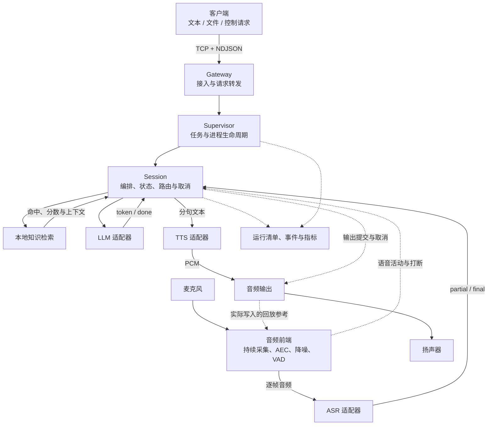

<div align="center">

# NexWeave

**面向边缘设备的智能任务底座**

从可测试的 C++ 核心，走向离线、流式、可打断的语音交互。


[](https://github.com/Caden-1224/nexweave/blob/main/LICENSE)

[项目背景](#background) · [系统架构](#architecture) · [设计方案](#design) · [当前状态](#status) · [快速开始](#quick-start) · [路线图](#roadmap)

</div>

---

## 项目简介

NexWeave 面向华为昇腾 AI 计算平台、鲲鹏处理器平台、瑞芯微 RK 系列等采用 Linux 的边缘计算环境，设计一套以 C++ 实现的智能任务底座。项目围绕任务生命周期、流式数据、取消、进程隔离和设备接入建立统一契约，让不同模型与设备能够在同一套执行逻辑中协作。

首个目标应用是一条完全离线的语音交互链路：设备持续接收音频，完成语音识别、本地知识检索、大模型推理和语音合成；回答可以分段生成、分段播放，用户在播报期间再次说话时能够打断旧回答。

开发从无需模型和声卡的 WSL/Linux 环境开始，逐步验证进程通信与故障恢复，再接入 **RK3576 泰山派**上的真实模型和音频设备。目标平台的内存预算、驱动版本、音频格式及多模型常驻能力，都以实际设备检查和实验为准。

平台适配采用“共享核心契约、分别接入后端”的方式。**RK3576 是首个硬件适配与验证目标**；昇腾、鲲鹏及其他 RK 型号属于后续适配方向，目前尚未验证，不表示已有对应硬件支持。不同平台仍需分别完成工具链、推理库、模型格式、设备能力和资源预算的验证。

| 平台方向 | 在项目中的定位 | 当前状态 |
|---|---|---|
| WSL / 通用 Linux 开发环境 | 构建核心模块和执行确定性测试 | 已验证当前开发配置 |
| 瑞芯微 RK3576 泰山派 | 首个真实模型与音频交互验证目标 | ASR/LLM/MeloTTS、ALSA 输入输出、全双工音频前端与多进程部署机制已交付；VAD 与完整闭环待后续 |

> **当前处于早期开发阶段。** 已实现基础契约、会话状态机、确定性 Fake 音频输入输出、Fake 流式 ASR/LLM/TTS、Fake RAG 路由、本地知识库检索与路由校准、常驻音频输入与语音分段、L2/L3 生成路径的流式分句与重叠播放、进程内 Supervisor 的单活跃会话生命周期、进程内 Gateway 的控制请求入口与有界发送、ZeroMQ 控制传输和 multipart 数据面适配、子进程的显式启动就绪、停止升级与身份隔离，多进程 Gateway 控制路由，独立子进程 Session 的增量音频上行与输出事件回流，Linux 多进程端到端链路、Linux profile 的重复启停与失败清理、Linux profile 单进程/多进程对照样本、RK3576 多进程部署 profile 的 Fake 拓扑验证，以及音频、控制响应、数据事件和终态缓存的有界策略。真实 ASR、文本推理、MeloTTS、ALSA 输入输出适配器与全双工音频前端已交付；前端已接入实际播放参考、16 kHz 领域帧和板端 WebRTC 前处理入口，VAD 与完整板端语音交互仍待后续。

<a id="background"></a>

## 项目背景

在昇腾、鲲鹏或瑞芯微 RK 等平台部署智能应用时，处理器架构、推理库和加速能力各不相同，但任务归属、数据顺序、取消和故障恢复仍需要明确约定。NexWeave 将这些共性行为放在核心模块，将平台差异留给适配器，以便逐个平台验证和接入。

边缘语音交互需要协调多种性质不同的工作：麦克风持续产生音频，大模型按自己的速度生成文字，语音合成按块返回音频，声卡则按固定速率播放。任何一个环节变慢，都会影响后面的等待时间和内存占用；用户取消时，已经排队的数据还可能继续流动。

直接把这些能力串联在一个业务函数中，模型调用很快会与线程、socket、设备句柄和退出逻辑混在一起。系统可以完成一次问答，却难以解释第二次请求为什么卡住、为什么取消后还有声音，或为什么更换模型需要修改整条链路。

NexWeave 将这些问题作为设计与验证的起点：

| 问题 | 对系统的影响 | NexWeave 的设计方向 |
|---|---|---|
| 多个模型共享 CPU、NPU 和内存 | 推理互相等待，加载失败，资源占用难以归因 | 独立适配器与进程隔离，记录各阶段资源；通过联合实验评估竞争 |
| 模型与设备生命周期不同 | 每次请求重复加载，或退出后残留资源 | 由明确的拥有者管理创建、使用、停止与释放 |
| 音频、文字和 PCM 连续产生 | 整段等待增加首响应时间，慢消费者造成积压 | 增量输入、流式事件和有界队列 |
| 长推理占住请求处理线程 | 查询和取消必须等推理结束 | 控制处理与实际执行分离，逐层验证取消可达 |
| 取消时仍有回调和排队音频 | 旧文本或旧播报进入新请求 | 生成代际隔离、输出提交检查与播放清理 |
| 扬声器声音回到麦克风 | 系统识别自己的回答，造成误打断 | 全双工音频前端、回放参考与回声消除 |
| SDK、驱动、模型和配置不断变化 | 同一问题难复现，性能比较失去依据 | 固定输入、配置哈希、版本链和原始事件记录 |

进程隔离能够限制一部分故障的影响范围，但不会增加设备算力，也不能消除共享 NPU 或驱动层的问题。NexWeave 将故障隔离、资源竞争和交互延迟分别验证。

语音是第一条完整应用链路。更通用的任务、协议、取消与后端契约，为后续设备能力保留扩展位置；当前范围聚焦单设备，不包含跨主机集群或多设备并发。

<a id="architecture"></a>

## 系统架构

以下为目标架构，正在按阶段实现。图中箭头表示逻辑关系，实际进程组合由部署 profile 决定，不固定为某个进程数量。



核心逻辑只认识 NexWeave 的领域值、事件和能力接口。ZeroMQ、ALSA、RKNN、RKLLM、MeloTTS 等外部类型由适配器封装；它们不会成为 Session 的调用前提。

### 外部接入、控制面与数据面

| 交互面 | 承载内容 | 目标实现 | 关键行为 |
|---|---|---|---|
| 外部接入 | 客户端输入、查询、取消与结果 | TCP + NDJSON | 处理半包、粘包、超长消息、断连和慢客户端 |
| 控制面 | 创建、查询、取消、退出及受理响应 | 版本化 JSON RPC、ZeroMQ 适配 | deadline、幂等、结构化错误，推理期间仍可响应 |
| 数据面 | 输入音频、识别文本、token、PCM 和结束事件 | JSON 元数据 + 二进制 PCM multipart | 流归属、顺序、长度、有界缓冲与关闭语义 |

当前已实现消息与事件的基础编解码、校验和值语义，进程内 Gateway 的 NDJSON 分帧与控制请求入口，ZeroMQ REQ/REP 控制传输，以及输入音频/输出事件的 ZeroMQ PAIR multipart 适配：半包、粘包、超长消息、断连取消和慢客户端关闭都已按上表约定实现；统一应用队列与背压策略已引入公共有界队列、显式容量/峰值账目和终态缓存保留期限；真实 HWM 压力与真实部署对照尚未交付。具体 socket 模式应服务于控制响应和流式行为，不将某种同步收发方式固定为所有后端的执行方式。

### 标识与结果归属

| 标识 | 职责 |
|---|---|
| `work_id` | 追踪一项边缘任务的生命周期 |
| `request_id` | 关联一次操作及其响应 |
| `session_id` | 关联连续交互上下文 |
| `generation` | 区分当前回答与取消、重启后的旧结果 |

音频采集、一次语音段和一次回答具有不同生命周期。取消回答时，麦克风可以继续采集；新语音的开头也不能被旧回答的清理动作删除。流身份与生成代际的结合，是后续交互契约扩展的重点。

<a id="design"></a>

## 设计方案

本节描述完整链路要满足的行为；已实现范围以“当前状态”为准。

### 1. 任务管理与进程隔离

Gateway 负责客户端接入，Supervisor 管理任务和子进程，Session 编排当前交互。模型适配器拥有各自的上下文，音频前端统一协调采集与播放资源。

设备同一时间只允许一个活跃 Session。外部新任务遇到忙碌状态时返回明确结果；会话内的新语音通过打断路径切换回答代际，避免用并发创建任务绕过约束。

启动成功需要区分“进程存在”和“后端就绪”。停止也需要区分取消受理、资源清理和最终退出。某个后端失败后，系统应报告旧任务的结果，再判断能否恢复服务；不能在重建时自动重播已经输出的回答。

### 2. 可替换的后端能力

统一接口覆盖音频输入、ASR、检索、LLM、TTS 和音频输出。调用方需要知道输入条件、事件顺序、错误和取消语义，但不需要知道模型句柄或声卡设备名。

| 能力 | 默认开发方式 | 目标板端实现 |
|---|---|---|
| 音频输入与输出 | 确定性 Fake | ALSA |
| ASR（自动语音识别） | 脚本驱动的 Fake 流式事件 | RKNN Zipformer |
| RAG（检索增强生成） | 固定检索夹具与路由 | 本地 JSONL 知识库、词项检索与路由校准 |
| LLM（大语言模型） | 确定性 token 流 | Qwen3.5-0.8B 的 RKLLM 文本推理 |
| TTS（文本转语音） | 确定性 PCM 流 | MeloTTS 离线合成（ONNX Runtime CPU 编码器 + RKNN NPU 解码器） |
| 音频前处理 | 可控音频与活动事件夹具 | WebRTC AEC/降噪、Silero VAD |

目前 Fake 音频、Fake ASR、Fake RAG 路由、Fake LLM 与 Fake TTS 均已实现相应的确定性模拟后端；真实检索、RKNN ASR、RKLLM 文本推理与 MeloTTS 离线适配器也已接入统一能力契约。

同一类接口并不意味着所有实现都能即时取消。适配器需要声明是否支持并发调用、回调何时结束、取消在哪些位置生效，以及失败后谁释放资源。现有默认串行调用约定不能被调用方擅自改变。

### 3. 增量识别与分级知识路由

目标输入路径从持续采集开始，经语音分段逐帧送入 ASR。远端识别器应在用户说完之前收到前面的音频，并产生可观察的识别进度；只在录音结束后上传整段数据不满足这一目标。

ASR 的 `partial` 表示当前识别假设，后续结果可能修正前面的文字；`final` 表示该段最终文本，不能把所有 partial 简单拼接。

识别结果进入本地路由：

| 路由 | 输入类型 | 执行方式 |
|---|---|---|
| L0 | 停止、取消等控制意图 | 执行控制路径，绕过 LLM |
| L1 | 满足校准条件的直接回答 | 使用知识内容进入 TTS |
| L2 | 需要知识上下文的问题 | 检索内容与用户输入共同交给 LLM |
| L3 | 无合适命中的普通对话 | 不注入未经支持的知识，直接进入 LLM |

检索记录命中项、分数、路由和决策原因。分数不直接等于正确概率；阈值需要在固定校准集上确定，再用独立问句集验收。知识库、文本处理方式和配置都要能够追溯。

### 4. 生成、合成与播放重叠

完整回答不必全部生成后才开始播放。Session 将 token 组织成句块，交给 TTS 产生 PCM，再进入播放设备，同时允许后续文字继续生成。

这条流水线需要处理无标点长文本、UTF-8 边界、最后一句刷新、慢 TTS 与慢播放。分句和音频队列均有上限，模型回调不能因为下游缓慢而无限等待。

三个完成时刻分别记录：

- **生成结束**：LLM 不再产生当前回答的文字。
- **合成结束**：当前文本的 PCM 已全部生成。
- **播放结束**：需要播放的数据已经输出完成。

某个后端的 `done` 只表示局部完成。Session 要根据本轮所需能力判断整体结果，避免语音仍在播放时提前宣布任务结束。

### 5. 全双工音频前端

全双工意味着设备在播放时仍能采集。扬声器声音也会进入麦克风，所以持续监听需要同时处理回声和用户语音。

AEC（Acoustic Echo Cancellation，声学回声消除）使用实际写入播放设备的参考信号估计回声；VAD（Voice Activity Detection，语音活动检测）判断处理后音频里的语音起止。前端还负责降噪、格式转换和设备恢复。

| 音频约定 | 数值或处理方式 |
|---|---|
| 内部采样率 | 16 kHz |
| 声道与编码 | 单声道、S16_LE |
| 帧长 | 20 ms，即 320 样本、640 字节 |
| 模型原生音频 | 在适配器显式重采样、转换和分帧 |
| 最后不足一帧 | 明确补齐方式与有效样本数，不静默截断 |
| 取消后的剩余数据 | 丢弃旧转换缓存和可清理的待播放数据 |

统一到 16 kHz 是当前兼容取舍，会舍弃更高采样率音频中的部分高频信息，不宣称无损。设备短写、欠载、断开或重连会影响回放连续性，前端需要重新建立对齐；设备恢复可用和 AEC 已收敛分别报告。

### 6. 取消、背压与故障恢复

一次打断会同时影响模型、回调、传输缓冲和声卡。目标取消流程是建立旧输出封锁，通知执行和播放清理，再报告完成或明确失败；具体并发顺序通过可控夹具和板端测试验证。

| 观察点 | 证明的事实 |
|---|---|
| 取消受理 | 控制请求已被处理 |
| 旧结果停止提交 | 旧代际文本和 PCM 不再进入当前输出 |
| 后端执行退出 | 计算结束，或已经按规定完成隔离与清理 |
| 待播放数据清空 | 可丢弃的软件和设备缓冲已处理 |
| 实际静默 | 测量条件下已无旧播报残余输出 |

generation 过滤不能代替停止计算，停止提交 PCM 也不能撤回已经发出的声音。因此取消确认和声学静默需要分别测量。

背压同样是一组明确约定：音频、文本、控制响应和终态分别规定容量与等待时间。满队列时控制取消仍要可处理；连续语音不能随意丢弃中间帧，断流需要明确失败或可验证的恢复策略。终态采用送达或查询机制，并说明断连、缓存过期后的结果。

<a id="status"></a>

## 当前状态

下表对应当前源码基线。已完成的基础模块不代表完整应用已经交付。

| 能力 | 状态 | 已完成或待验证的范围 |
|---|---|---|
| C++17、CMake、CTest 与许可证 | 已实现 | 独立构建、测试入口及构建失败门禁 |
| 标识、错误和音频帧 | 已实现 | 值对象、范围和格式校验 |
| 后端能力接口 | 已实现基础版 | 六类能力接口及最小契约夹具；交互契约扩展已实现（流输入事件、尾帧生产与代际封锁） |
| Session 状态与生成代际 | 已实现基础版 | 状态迁移、取消代际与过时事件拒绝；各阶段统一取消与旧输出隔离已实现（见下方 Session 语音路径行） |
| 控制消息与数据事件 | 已实现基础版 | JSON 编解码、元数据与二进制 PCM 校验；网络服务未实现 |
| Fake 音频输入输出 | 已实现 | 模拟帧输入、输出、取消和轮次行为 |
| Fake 流式 ASR | 已实现 | 脚本驱动的 partial/final/done、取消与重开 |
| 运行清单、事件与指标 | 已实现 | 值对象、编解码与运行证据生产者；一次 Mock 运行实际产出清单、事件、指标与摘要（见下方 Mock 运行证据行） |
| Fake RAG L0-L3 路由 | 已实现 | 固定检索夹具、分级决策与取消封锁 |
| Fake 流式 LLM | 已实现 | 确定性 token 流、取消与回调失败封锁 |
| Fake 流式 TTS | 已实现 | 逐帧 PCM、确定性波形与并发取消 |
| Session 语音路径 | 已实现基础版 | L0/L1 音频到识别与直答；L2/L3 走 LLM 并按句流式合成，首段播放早于生成结束；端到端取消已实现（旧结果不再提交） |
| 常驻音频输入与语音分段 | 已实现基础版 | 跨轮次保持的单一输入拥有者、确定性活动脚本、前置缓冲与容量上限、播报期间新语音打断旧回答；真实 VAD、跨进程取消待后续任务 |
| 进程内 Supervisor 生命周期 | 已实现基础版 | 设备级单活跃会话、忙碌拒绝、取消受理与清理完成的分别报告、清理未完成时槽位不可复用 |
| 子进程生命周期 | 已实现基础版 | 显式就绪通知、SIGTERM/SIGKILL 有界停止升级、正常退出/信号退出/强杀原因归档、身份不复用与旧身份迟到操作拒绝；跨进程 Session 已接入独立适配器，统一背压尚未交付 |
| 进程内 Gateway 请求入口 | 已实现基础版 | NDJSON 分帧、四类控制操作、受理响应与执行终态分离、请求幂等、有界发送与慢客户端关闭、断连取消策略；真实 TCP 传输与端到端背压待后续任务 |
| 多进程 Gateway 控制路由 | 已实现基础版 | 复用同一套 NDJSON/ControlRequest/ControlResponse 与幂等语义，经有界工作线程池异步转发到独立进程中的 Gateway+Supervisor；慢转发与推理阻塞时其他控制操作仍可推进，远端不可用返回结构化错误 |
| 多进程 Session 适配 | 已实现基础版 | 独立子进程承载 Session 与确定性 Fake 后端；队列音频源逐帧上行，PAIR 数据面回传文本、PCM 与终态；取消、满队列、子进程启动失败和重复启停都有结构化收敛 |
| 有界数据流与背压 | 已实现基础版 | 公共有界队列区分拒绝、淘汰和关闭策略；音频、控制响应、数据事件和终态缓存记录容量、峰值与等待/过期事实；连续音频不使用 latest-only；慢消费者、输出队列满和终态查询有测试；真实 HWM 压力与完整 Linux profile 暂未交付 |
| Linux 多进程端到端链路 | 已实现基础版 | 本地 Gateway 控制路由经独立 Session 进程完成增量输入、Fake Session 推理、文本/PCM/终态回传和退出清理；单活跃忙碌拒绝与远端播放/生成顺序有夹具证据；故障恢复已实现基础版 |
| Linux profile 生命周期 | 已实现基础版 | 独立子进程的重复启动、停止、重启，启动失败回滚，活跃输入/推理期间停止，终态后迟到输出拒绝，以及有界进程与端点清理；完整部署入口与对照证据待后续 |
| Linux profile 对照证据 | 已实现基础版 | 同一 Fake Session 夹具在同进程与独立子进程中运行，保留原始延迟、RSS、队列峰值与成功率样本并输出汇总 JSON；只证明 Fake 调度与拓扑差异，不证明模型、NPU 或板端性能 |
| RK3576 部署 profile | 已实现基础版 | 显式进程拓扑、唯一音频拥有者、按依赖等待每个子进程显式就绪、反序停止、部分启动失败回滚和 SIGKILL 升级；先以 Fake 节点验证部署机制，真实模型/ALSA 构件在后续任务汇合时重跑同一门禁 |
| Mock profile 确定性入口 | 已实现 | 单进程组装工厂、监督器与请求入口，四个可显式选择的场景（正常、慢消费、取消、故障）、固定输入逐字节可复现、退出码语义、运行结束清理自证 |
| Mock 运行证据 | 已实现 | 一次运行产生五份产物（run-manifest.json、events.jsonl、metrics.jsonl、protocol.jsonl、summary.md）；单调时间族与调度步数族分开标注，未测量项如实标注；`--evidence-dir` 留档，`--out-dir` 仍验证“返回即无残留” |
| Gateway 传输与 ZeroMQ | 控制面与数据面适配已实现基础版 | ZeroMQ REQ/REP 控制传输、deadline 与幂等；PAIR multipart 输入音频/输出事件、二元长度与顺序校验；统一队列与终态缓存已接入，Linux 多进程端到端基础链路已交付；真实 HWM 压力与板端部署对照待后续 |
| 本地知识库与真实检索 | 已实现基础版 | 固定 JSONL 知识库、BM25 词项检索、L0-L3 阈值与上下文字节预算校准；板端真实知识库部署待后续任务 |
| RK3576 模型与音频前端 | ASR、文本推理与 MeloTTS 适配器已实现，其余规划中 | Zipformer RKNN ASR 已完成板端增量输入、结束刷新、取消、重置与错误路径验证；Qwen3.5-0.8B 文本推理已完成真实 RKLLM 流式 token、取消、队列溢出与恢复验证；MeloTTS 已完成 ONNX CPU 编码器 + RKNN NPU 解码器、16 kHz 分块重采样、尾部补零、取消与恢复验证；Silero VAD 仅完成最小推理预检；正式 ALSA/AEC 与完整链路仍待交付 |
| 板端故障与稳定性验证 | 待前置能力完成 | 真实闭环、打断、恢复和资源实验 |

Fake ASR 不识别真实波形，而是按预设脚本产生事件。它用于验证协议和生命周期，不提供语音识别准确率。

Session 的 L0/L1 路径同样只编排注入的确定性能力：它把输入音频交给识别能力，按路由级别选择直答文本，逐帧合成 PCM 并交给播放组件，最后以“文本定稿 → 合成结束 → 播放结束”的顺序收尾。播放是否完成由注入的播放组件报告，因此同一段音频在设备时间不前进时会被如实报告为“未完成”，而不是把合成结束当成播放结束。停止类控制意图不进入检索与合成，按统一取消语义收敛。

常驻音频输入把“持续采集”和“按轮次回答”分开：一条输入流只有一个拥有者，采集生命周期跨越多轮回答，回答正常收尾或被取消都不会关闭采集，也不会丢弃已经攒下的新语音。语音分段由固定活动脚本驱动，用显式的前置缓冲、静音超时和长度上限复现起音、结束、短脉冲与最长说话，不依赖真实时间或睡眠；逐帧活动判定是一个可替换接缝，真实 VAD 将在后续任务接入同一分段契约。会话在播放交付边界消费“用户开始说话”的通知，按统一取消语义打断旧回答，而新语音的开头仍留在输入队列里，作为下一轮的输入被逐帧识别。

Supervisor 回答的是设备级问题，而不是某一轮怎么处理：现在能不能再开会话、用户喊停之后有没有停干净、上一次会话留下的资源能不能给下一次用。它持有唯一的活跃槽位，把会话的建立、执行与清理交给一个拥有者，并且只有在拥有者确认资源已交还之后才把槽位放出去——清理失败或等待超时的槽位会永久标记为不可用，而不是“再试一次也许就好了”。占用期间的新建请求返回可重试的忙碌错误，不排队也不替换；语音打断走会话内部的代际切换，不通过并发创建实现。取消的受理与清理的完成是两个独立事实：受理只保证旧结果不再提交，不代表设备已经安静。进程内拥有者把单进程会话应用接到这条接缝上；子进程拥有者把 fork/exec、就绪等待、SIGTERM/SIGKILL 升级和退出归档接到同一条拥有者接缝上，独立 Session 适配器已把持续输入与事件回流接到数据面；统一背压与完整 profile 尚未交付。

Gateway 是外部客户端与设备运行时之间唯一的一层：它接收按行分隔的 JSON 控制请求，把创建、查询、取消和退出路由到 Supervisor，并把会话结果转成数据面事件。字节流与消息不是一回事，因此分帧单独成层——半包留在缓冲里、粘包按行拆开、没有换行的超长输入在超过声明上限时被丢弃并在下一个换行处重新同步，缓冲因此不会随连接的存活时间增长。受理与终态在这里也是两件事：创建请求的响应只说明“会话被受理了”，这一次会话最终成功、失败还是被取消由随后 `end=true` 的终态事件回答；取消响应报告的是受理与清理快照，而不是“设备已经静默”。发送方向同样有界：控制响应与数据事件各有一条有界队列，控制响应优先取走，任一队列达到上限即关闭连接并记录原因，而不是静默丢弃已经产生的输出。无法归属到请求的非法输入没有可寻址的答复对象，因此记录原因并关闭连接；能取出合法 request_id 的非法输入得到结构化错误且连接保持可用。连接断开只取消它自己发起的那次会话，终态没有接收者时计入丢弃账目。ZeroMQ 控制传输已把这条请求入口接到真实 socket；多进程模式通过路由接缝把这套控制语义转发到独立 Supervisor，同时保留本地分帧、幂等和有界发送。逐帧音频上行与输出事件回流已由独立 Session 适配验证；公共有界队列与终态缓存已接入，端到端 profile 对照已交付 Fake 拓扑基础版；真实部署对照尚未交付。

Mock profile 把上面四层组装成一条可复现的命令：`nexweave_mock_profile --scenario <名字>`。场景决定形态，旋钮决定时序，两者分开之后同一条不变量可以在不同打断点上回归。四个场景各守一类收敛方式：正常路径要按发生顺序交付事件并最终成功；慢消费要由**有界发送缓冲**触发连接关闭，而不是让缓冲随输出增长；取消要打断一个**确实在途**的会话，退出码仍为 0 而终态明确是取消；故障要证明输入不可用时以明确错误收敛、清理照常完成。确定性不靠“跑得巧”：场景里没有时钟、没有睡眠、没有随机数；取消用一道闸门把“会话正在执行”从时序巧合变成确定状态，闸门在提交创建**之前**布置，等待期间同时驱动请求入口。运行结束前释放全部线程、连接与产物，并由账目自证（创建的线程数等于已回收数、仍打开的连接数为 0、产物已删除）。退出码回答的是“这条命令有没有按本次验收目标跑完”，因此取消与预期内的故障都是 0；会话成没成由事件流里的终态回答——把两者压进同一个数字，就无法区分“按预期失败”和“根本没跑起来”。

<a id="quick-start"></a>

## 快速开始

推荐 Ubuntu 22.04 或 WSL Ubuntu 22.04。当前构建需要 C++17 编译器、CMake ≥ 3.16、Make、Bash、nlohmann-json ≥ 3.10 和 libzmq3-dev，无需模型、NPU SDK 或声卡。

```bash
sudo apt update
sudo apt install -y git build-essential cmake nlohmann-json3-dev libzmq3-dev

git clone https://github.com/Caden-1224/nexweave.git
cd nexweave

./scripts/test.sh
```

测试脚本会先配置并构建，再运行 CTest。编译失败时不会执行旧测试程序；默认使用 Release，当前入口是库、测试套件、单进程应用 `nexweave_session_app`、Mock profile 入口 `nexweave_mock_profile`，以及 ZeroMQ 控制/数据面集成测试。两个命令行门禁分别覆盖：参数错误与三种输入模式、确定性一致与信号退出（`session_app_cli`）；四个场景的退出码与关键字段、重复运行逐字节一致、产物清空与不链接硬件库（`mock_profile_cli`）。真实 RKNN ASR、RKLLM 文本与 MeloTTS 适配器已实现，但默认不参与 WSL 构建；ALSA 与完整板端入口仍待交付。

跑一次 Mock profile：

```bash
build/nexweave_mock_profile --scenario normal    # 正常：受理 → 执行 → 事件 → 成功终态
build/nexweave_mock_profile --scenario slow      # 慢消费：有界缓冲触发连接关闭
build/nexweave_mock_profile --scenario cancel --cancel-after-pcm 3
build/nexweave_mock_profile --scenario fault     # 输入不可用：明确失败、清理照常

build/nexweave_mock_profile --scenario normal --events --out-dir /tmp/nexweave-run
build/nexweave_mock_profile --help
```

同一命令重复执行输出逐字节一致（不含时间戳），可直接用于回归比对。`--out-dir` 会在运行结束前删除本次产物，只保留目录本身。

<details>
<summary>Debug、严格警告与契约测试</summary>

```bash
BUILD_DIR=build/debug BUILD_TYPE=Debug ./scripts/test.sh

cmake -S . -B build/strict \
  -DCMAKE_BUILD_TYPE=Release \
  -DNEXWEAVE_WARNINGS_AS_ERRORS=ON
cmake --build build/strict -j2
ctest --test-dir build/strict --output-on-failure

ctest --test-dir build/strict -L contract --output-on-failure
```

`BUILD_DIR` 和 `BUILD_TYPE` 同时适用于构建与测试脚本。自定义依赖安装可通过 `nlohmann_json_DIR`、`CMAKE_PREFIX_PATH` 或 ZeroMQ 的 `NEXWEAVE_ZMQ_INCLUDE_DIR`、`NEXWEAVE_CPPZMQ_INCLUDE_DIR`、`NEXWEAVE_ZMQ_LIBRARY` 指定；缺失依赖时 CMake 会报告安装提示。

</details>

<details>
<summary>可选：构建全双工音频前端与 WebRTC 前处理</summary>

全双工前端默认使用受控 Fake 前处理器与受控 PCM 后端回归，不链接 ALSA/WebRTC。
板端真实路径必须同时打开 ALSA 与 WebRTC 音频处理库，并显式提供库文件绝对路径；
默认运行库包可能没有开发符号链接，因此不要求 `find_library` 找到短名：

- `NEXWEAVE_ENABLE_ALSA=ON`
- `NEXWEAVE_ENABLE_WEBRTC_APM=ON`
- `NEXWEAVE_WEBRTC_LIBRARY=/usr/lib/aarch64-linux-gnu/libwebrtc_audio_processing.so.1`

```bash
cmake -S . -B build/hardware-frontend \
  -DCMAKE_BUILD_TYPE=Release \
  -DNEXWEAVE_WARNINGS_AS_ERRORS=ON \
  -DNEXWEAVE_ENABLE_ALSA=ON \
  -DNEXWEAVE_ENABLE_WEBRTC_APM=ON \
  -DNEXWEAVE_WEBRTC_LIBRARY=/path/to/libwebrtc_audio_processing.so
cmake --build build/hardware-frontend \
  --target nexweave_audio_frontend_hardware_test -j2
```

板端入口按固定设备、原生采样率和声道数运行，支持近端、只有播放、双讲、取消和
重复启停场景。AEC 状态只表示配置的软件收敛门限是否满足；回声残留、语音影响和
资源开销必须在固定音量、距离、输入录音与噪声条件下另行测量，未测量项不得写成
硬件结论。

</details>

<details>
<summary>可选：构建 RKNN/RKLLM/MeloTTS 硬件适配器</summary>

硬件适配器默认不参与 WSL Fake 构建。启用时需要显式提供厂商 Runtime 与特征库，
仓库不提交 SDK、动态库或模型文件：

RKNN Zipformer：

- `NEXWEAVE_RKNN_ROOT/include/rknn_api.h`
- `NEXWEAVE_RKNN_ROOT/include/kaldi-native-fbank/csrc/online-feature.h`
- `NEXWEAVE_RKNN_ROOT/lib/librknnrt.so`
- `NEXWEAVE_RKNN_ROOT/lib/libkaldi-native-fbank-core.a`

RKLLM 文本推理：

- `NEXWEAVE_RKLLM_ROOT/include/rkllm.h`
- `NEXWEAVE_RKLLM_ROOT/lib/librkllmrt.so`

MeloTTS 离线适配器：

- `NEXWEAVE_MELOTTS_ROOT/include/onnxruntime_c_api.h`
- `NEXWEAVE_MELOTTS_ROOT/include/rknn_api.h`
- `NEXWEAVE_MELOTTS_ROOT/lib/libonnxruntime.so`
- `NEXWEAVE_MELOTTS_ROOT/lib/librknnrt.so`

```bash
cmake -S . -B build/hardware \
  -DCMAKE_BUILD_TYPE=Release \
  -DNEXWEAVE_ENABLE_RKNN=ON \
  -DNEXWEAVE_RKNN_ROOT=/path/to/rknn-deps \
  -DNEXWEAVE_ENABLE_RKLLM=ON \
  -DNEXWEAVE_RKLLM_ROOT=/path/to/rkllm-deps \
  -DNEXWEAVE_ENABLE_MELOTTS=ON \
  -DNEXWEAVE_MELOTTS_ROOT=/path/to/ort-rknn-deps
cmake --build build/hardware \
  --target nexweave_rknn_zipformer_hardware_test \
           nexweave_rkllm_hardware_test \
           nexweave_melotts_hardware_test -j2
```

板端测试通过统一能力接口驱动真实模型，模型、词表、tokens 与 g 向量由命令行传入：
RKNN ASR 支持 `success`、`short`、`long`、`cancel`、`callback-failure`、`invalid`；
RKLLM 文本支持 `success`、`long`、`cancel`、`callback-failure`、`queue-overflow`、`invalid`；
MeloTTS 离线适配器支持 `success`、`long`、`cancel`、`callback-failure`、`invalid`。
MeloTTS 输出统一为 16 kHz、单声道、S16_LE、20 ms、320 样本帧；原生 44.1 kHz
信息经线性重采样转换为 16 kHz，尾部补零样本不计入有效时长，也不宣称保留原生高频。
测试只记录当前输入、配置和运行时版本下的可复现事实，不把单次耗时写成吞吐或可靠性结论。

</details>

<a id="deployment"></a>

## 部署方式

完整部署将分三类 profile 验证。profile 描述进程拓扑与后端组合，保持上层领域行为一致。

| Profile | 使用场景 | 目标组合 | 验证重点 |
|---|---|---|---|
| Mock | 日常开发与确定性回归 | Fake 音频及推理后端 | 事件顺序、重叠执行、取消和故障夹具 |
| Linux | 通信与系统行为验证 | 多进程、ZeroMQ、Fake 后端 | 控制可响应、增量上行、背压、重建与清理 |
| RK3576 | 真实离线交互 | 硬件模型、ALSA、AEC 与 VAD | 模型兼容、音频交互、实际静默与资源竞争 |

Mock profile 已可运行：`nexweave_mock_profile` 用进程内 Fake 后端跑通四个确定性场景。Linux profile 已实现生命周期管理和单/多进程 Fake 对照测试。RK3576 profile 已交付部署机制基础版：拓扑中只允许一个音频拥有者，适配器消费者必须在依赖上晚于拥有者；启动、就绪、停止、部分启动失败回滚和 SIGKILL 升级先用 Fake 节点验证，真实模型、ALSA、AEC/VAD 构件在后续汇合时重跑同一门禁。部署前仍要检查实际系统、驱动、SDK、模型、音频设备和最小真实推理；不能仅凭模型文件存在就判定可部署。

RK3576 源码部署包由 `bash scripts/package_rk3576_deployment.sh [输出.tar.gz]` 生成。脚本只收集 Git 中会进入部署的源码，并在打包前后拒绝模型、SDK、动态库、构建缓存、日志、凭据、令牌和私钥；模型与厂商运行库始终由板端外部目录提供。

<a id="validation"></a>

## 测试与实验

当前测试覆盖已实现模块的正常路径、非法输入、边界、取消与重开。后续验证沿相同接口扩展，既检查输出内容，也检查输出归属和失败后的状态。

当前在 `CMakeLists.txt` 中注册的 CTest 标签只有 `unit`、`contract`、`integration` 与 `gate` 四类；下表中标注“后续任务”的层级是验证目标，尚未注册为测试标签。

| 层级 | 当前是否注册 | 主要验证内容 |
|---|---|---|
| Unit | 已注册 | 标识、音频格式、错误、状态迁移、协议、路由与播放节奏 |
| Contract | 已注册 | Fake 和真实后端是否满足同一类能力约定 |
| Integration | 已注册 | 请求转发、进程生命周期、数据传输和设备协作 |
| Gate | 已注册 | 构建脚本可读失败、源码变化必须先重建，以及命令行入口的参数错误、三种输入模式、确定性一致与信号退出 |
| End-to-end | 后续任务 | 文本或音频输入到最终文本、PCM 与播放结果 |
| Fault | 后续任务 | 取消、超时、断连、满队列、节点退出与设备异常 |
| Hardware | 后续任务 | 模型/驱动兼容、双向音频、声学行为与资源占用 |
| Stability | 后续任务 | 固定输入和配置下的重复闭环及资源趋势 |

目标证据包含运行清单、原始事件、指标与摘要，关联源码 commit、工具版本、设备、模型、驱动、配置和输入哈希。测试通过只说明对应行为被验证，不能直接换算为系统吞吐或可靠性。

板端实验将重点记录：

| 指标 | 计时或统计口径 |
|---|---|
| 首 partial、端点到 final | 区分识别过程中的首次输出与用户说完后的收尾耗时 |
| 首 token、首 PCM、首播放 | 区分文字生成、音频生成和真实播放启动 |
| 端到端延迟 | 说明输入起点与完成终点，报告样本量及分位数算法 |
| 取消收敛 | 分别记录受理、计算退出、缓冲清理与实际静默 |
| 故障恢复 | 从故障注入到清理、重新就绪及下一轮成功 |
| 资源与积压 | CPU、RSS、可采集的 NPU 指标、队列峰值和丢帧 |

**目前没有 NexWeave 板端性能数据。** 正常闭环计划执行 30 轮；打断、故障恢复和多模型资源竞争单独分组。30 轮结果不能作为长期可靠性或稳定 P99 的充分证据。

<a id="source-guide"></a>

## 技术栈与代码入口

| 方向 | 当前实现 | 后续接入 |
|---|---|---|
| 语言与构建 | C++17、CMake、CTest、Bash | 同一构建基础扩展硬件目标 |
| 消息与记录 | nlohmann-json、领域值与校验 | 网络事件传输和完整采集链路 |
| 通信 | ZeroMQ REQ/REP 控制适配、PAIR multipart 数据适配 | TCP/NDJSON、统一队列与背压 |
| 推理 | Fake 能力、RKNN ASR、RKLLM 文本、MeloTTS 离线 TTS | 在线模型和更多 NPU 型号 |
| 音频 | 固定格式帧、Fake 输入输出 | ALSA、WebRTC AEC/降噪、Silero VAD |

源码当前按以下职责组织：

| 入口 | 内容 |
|---|---|
| [core/domain](https://github.com/Caden-1224/nexweave/tree/main/core/domain) | 标识、生成代际、音频帧、版本与错误 |
| [core/capability](https://github.com/Caden-1224/nexweave/tree/main/core/capability) | 后端接口及输入、取消、回调约定 |
| [core/runtime](https://github.com/Caden-1224/nexweave/tree/main/core/runtime) | 会话监督器与单活跃槽位、Session 状态迁移与代际检查、L0-L3 会话编排与流式分句、交互契约扩展、常驻音频输入与语音分段 |
| [core/protocol](https://github.com/Caden-1224/nexweave/tree/main/core/protocol) | 控制消息、数据事件与序列化校验 |
| [core/gateway](https://github.com/Caden-1224/nexweave/tree/main/core/gateway) | NDJSON 增量分帧、控制请求路由、幂等记录与有界发送 |
| [core/transport](https://github.com/Caden-1224/nexweave/tree/main/core/transport) | ZeroMQ REQ/REP 控制传输、PAIR multipart 数据面、socket/线程生命周期、deadline 与顺序校验 |
| [core/profile](https://github.com/Caden-1224/nexweave/tree/main/core/profile) | Mock profile 组装、四个确定性场景、运行账目与产物留档；Linux profile 子进程启停、重启与失败清理 |
| [core/backend](https://github.com/Caden-1224/nexweave/tree/main/core/backend) | Fake 音频/ASR/RAG/LLM/TTS、BM25 本地知识库检索，以及 RKNN Zipformer、RKLLM 文本和 MeloTTS 离线适配器 |
| [core/observability](https://github.com/Caden-1224/nexweave/tree/main/core/observability) | 运行清单、事件与指标的值对象与编解码，以及把它们从一次运行里采集出来的证据记录器 |
| [tests](https://github.com/Caden-1224/nexweave/tree/main/tests) | 单元、契约及构建门禁测试 |
| [scripts](https://github.com/Caden-1224/nexweave/tree/main/scripts) | 构建与测试入口 |

建议先读能力接口，再对照 Fake 实现与测试了解调用顺序。公共头文件中的所有权、线程和错误说明，是使用接口所需的一部分。

<a id="roadmap"></a>

## 路线图与范围

- [x] 独立构建、许可证和测试门禁
- [x] 标识、音频、错误、状态机、代际与协议基础
- [x] Fake 音频输入输出与流式 ASR
- [x] 交互契约扩展、Fake RAG/LLM/TTS 与完整 Session
- [x] 常驻音频输入、语音分段与播报期间打断（确定性 Fake）
- [x] 生成与播放重叠、端到端取消
- [x] 进程内 Supervisor 与单活跃会话生命周期
- [x] 子进程显式就绪、停止升级与退出身份隔离
- [x] 多进程 Gateway 控制路由到独立 Supervisor
- [x] 多进程 Session 适配：独立子进程、增量音频上行与事件回流
- [x] 有界数据流与背压：音频/控制/数据/终态容量、峰值、关闭与过期策略
- [x] Linux 多进程端到端链路：增量输入、独立 Session、事件回流与退出清理
- [x] 进程内 Gateway 请求入口、请求幂等与有界发送
- [x] Mock profile 确定性入口与四个可复现场景
- [x] Mock 运行证据与运行目录（run-manifest、events、metrics 留档）
- [x] Linux profile 启停、重启与失败清理
- [x] Linux profile 故障恢复、启停清理与对照证据
- [ ] 本地知识库、真实检索与路由校准
- [x] RK3576 多进程部署 profile：音频唯一拥有者、启动就绪顺序、停止与部分启动失败回滚（先用 Fake 验证）
- [x] RK3576 全双工音频前端：双向资源唯一拥有者、实际播放参考、AEC/降噪、10 ms 窗口与恢复状态
- [ ] RK3576 模型、真实 VAD 与完整语音打断
- [ ] 故障恢复、板端实验与发布验证

第一版以 RK3576 为唯一硬件适配目标，聚焦单设备上的离线语音链路；昇腾、鲲鹏和其他 RK 型号的适配不进入本版门禁。Qwen3.5-0.8B 仅使用文本推理能力；视觉输入、机器人动作、跨主机集群、多设备并发、在线 LLM/TTS 和模型训练不在当前范围。

唤醒/休眠、暂停续说、推测性回答、保留原生高采样率播放、PREEMPT_RT 和自适应降级可以在基础链路稳定后扩展。接口仍在演进，当前不承诺跨版本二进制兼容。

## 参与开发

欢迎通过[源码仓库](https://github.com/Caden-1224/nexweave)交流问题和改进建议。问题报告请包含版本、环境、最小输入、执行命令、预期结果与实际结果；设备问题补充模型、驱动和音频配置。

代码改动应附相关验证。公共接口使用中文说明职责、输入输出、所有权、线程约定、错误及清理路径；模型和设备实现通过适配器接入。

## 许可证与依赖

自有实现采用 [MIT License](https://github.com/Caden-1224/nexweave/blob/main/LICENSE)。当前依赖和第三方再分发要求见 [NOTICE](https://github.com/Caden-1224/nexweave/blob/main/NOTICE)。

模型权重、厂商 SDK、动态库、凭据和现场录音不随源码提供。后续依赖按各自许可证与发布要求登记，不将自有代码的 MIT 许可扩大解释为所有模型和组件均可自由再分发。
