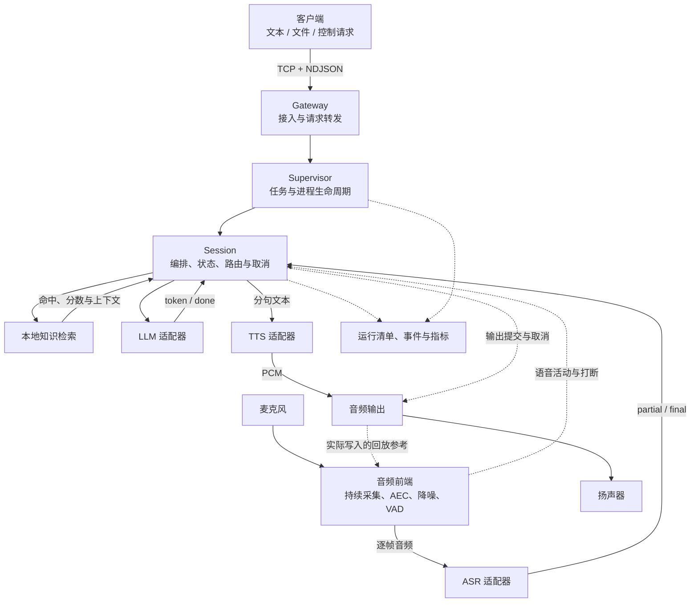

<div align="center">

# NexWeave

**面向边缘设备的智能任务底座**

从可测试的 C++ 核心，走向离线、流式、可打断的语音交互。


[](https://github.com/Caden-1224/nexweave/blob/main/LICENSE)

[项目背景](#background) · [系统架构](#architecture) · [设计方案](#design) · [当前状态](#status) · [快速开始](#quick-start) · [路线图](#roadmap)

</div>

---

## 项目简介

NexWeave 面向华为昇腾 AI 计算平台、鲲鹏处理器平台、瑞芯微 RK 系列等采用 Linux 的边缘计算环境，设计一套以 C++ 实现的智能任务底座。项目围绕任务生命周期、流式数据、取消、进程隔离和设备接入建立统一契约，让不同模型与设备能够在同一套执行逻辑中协作。

首个目标应用是一条完全离线的语音交互链路：设备持续接收音频，完成语音识别、本地知识检索、大模型推理和语音合成；回答可以分段生成、分段播放，用户在播报期间再次说话时能够打断旧回答。

开发从无需模型和声卡的 WSL/Linux 环境开始，逐步验证进程通信与故障恢复，再接入 **RK3576 泰山派**上的真实模型和音频设备。目标平台的内存预算、驱动版本、音频格式及多模型常驻能力，都以实际设备检查和实验为准。

平台适配采用“共享核心契约、分别接入后端”的方式。**RK3576 是首个硬件适配与验证目标**；昇腾、鲲鹏及其他 RK 型号属于后续适配方向，目前尚未验证，不表示已有对应硬件支持。不同平台仍需分别完成工具链、推理库、模型格式、设备能力和资源预算的验证。

| 平台方向 | 在项目中的定位 | 当前状态 |
|---|---|---|
| WSL / 通用 Linux 开发环境 | 构建核心模块和执行确定性测试 | 已验证当前开发配置 |
| 瑞芯微 RK3576 泰山派 | 首个真实模型与音频交互验证目标 | 硬件适配尚未完成 |

> **当前处于早期开发阶段。** 已实现基础契约、会话状态机、确定性 Fake 音频输入输出、Fake 流式 ASR/LLM/TTS、Fake RAG 路由、常驻音频输入与语音分段，以及 L2/L3 生成路径的流式分句与重叠播放。网络服务、真实模型和板端语音交互尚未交付。

<a id="background"></a>

## 项目背景

在昇腾、鲲鹏或瑞芯微 RK 等平台部署智能应用时，处理器架构、推理库和加速能力各不相同，但任务归属、数据顺序、取消和故障恢复仍需要明确约定。NexWeave 将这些共性行为放在核心模块，将平台差异留给适配器，以便逐个平台验证和接入。

边缘语音交互需要协调多种性质不同的工作：麦克风持续产生音频，大模型按自己的速度生成文字，语音合成按块返回音频，声卡则按固定速率播放。任何一个环节变慢，都会影响后面的等待时间和内存占用；用户取消时，已经排队的数据还可能继续流动。

直接把这些能力串联在一个业务函数中，模型调用很快会与线程、socket、设备句柄和退出逻辑混在一起。系统可以完成一次问答，却难以解释第二次请求为什么卡住、为什么取消后还有声音，或为什么更换模型需要修改整条链路。

NexWeave 将这些问题作为设计与验证的起点：

| 问题 | 对系统的影响 | NexWeave 的设计方向 |
|---|---|---|
| 多个模型共享 CPU、NPU 和内存 | 推理互相等待，加载失败，资源占用难以归因 | 独立适配器与进程隔离，记录各阶段资源；通过联合实验评估竞争 |
| 模型与设备生命周期不同 | 每次请求重复加载，或退出后残留资源 | 由明确的拥有者管理创建、使用、停止与释放 |
| 音频、文字和 PCM 连续产生 | 整段等待增加首响应时间，慢消费者造成积压 | 增量输入、流式事件和有界队列 |
| 长推理占住请求处理线程 | 查询和取消必须等推理结束 | 控制处理与实际执行分离，逐层验证取消可达 |
| 取消时仍有回调和排队音频 | 旧文本或旧播报进入新请求 | 生成代际隔离、输出提交检查与播放清理 |
| 扬声器声音回到麦克风 | 系统识别自己的回答，造成误打断 | 全双工音频前端、回放参考与回声消除 |
| SDK、驱动、模型和配置不断变化 | 同一问题难复现，性能比较失去依据 | 固定输入、配置哈希、版本链和原始事件记录 |

进程隔离能够限制一部分故障的影响范围，但不会增加设备算力，也不能消除共享 NPU 或驱动层的问题。NexWeave 将故障隔离、资源竞争和交互延迟分别验证。

语音是第一条完整应用链路。更通用的任务、协议、取消与后端契约，为后续设备能力保留扩展位置；当前范围聚焦单设备，不包含跨主机集群或多设备并发。

<a id="architecture"></a>

## 系统架构

以下为目标架构，正在按阶段实现。图中箭头表示逻辑关系，实际进程组合由部署 profile 决定，不固定为某个进程数量。



核心逻辑只认识 NexWeave 的领域值、事件和能力接口。ZeroMQ、ALSA、RKNN、RKLLM、MeloTTS 等外部类型由适配器封装；它们不会成为 Session 的调用前提。

### 外部接入、控制面与数据面

| 交互面 | 承载内容 | 目标实现 | 关键行为 |
|---|---|---|---|
| 外部接入 | 客户端输入、查询、取消与结果 | TCP + NDJSON | 处理半包、粘包、超长消息、断连和慢客户端 |
| 控制面 | 创建、查询、取消、退出及受理响应 | 版本化 JSON RPC、ZeroMQ 适配 | deadline、幂等、结构化错误，推理期间仍可响应 |
| 数据面 | 输入音频、识别文本、token、PCM 和结束事件 | JSON 元数据 + 二进制 PCM multipart | 流归属、顺序、长度、有界缓冲与关闭语义 |

当前已实现消息与事件的基础编解码、校验和值语义；表中的网络服务与传输适配尚未实现。具体 socket 模式应服务于控制响应和流式行为，不将某种同步收发方式固定为所有后端的执行方式。

### 标识与结果归属

| 标识 | 职责 |
|---|---|
| `work_id` | 追踪一项边缘任务的生命周期 |
| `request_id` | 关联一次操作及其响应 |
| `session_id` | 关联连续交互上下文 |
| `generation` | 区分当前回答与取消、重启后的旧结果 |

音频采集、一次语音段和一次回答具有不同生命周期。取消回答时，麦克风可以继续采集；新语音的开头也不能被旧回答的清理动作删除。流身份与生成代际的结合，是后续交互契约扩展的重点。

<a id="design"></a>

## 设计方案

本节描述完整链路要满足的行为；已实现范围以“当前状态”为准。

### 1. 任务管理与进程隔离

Gateway 负责客户端接入，Supervisor 管理任务和子进程，Session 编排当前交互。模型适配器拥有各自的上下文，音频前端统一协调采集与播放资源。

设备同一时间只允许一个活跃 Session。外部新任务遇到忙碌状态时返回明确结果；会话内的新语音通过打断路径切换回答代际，避免用并发创建任务绕过约束。

启动成功需要区分“进程存在”和“后端就绪”。停止也需要区分取消受理、资源清理和最终退出。某个后端失败后，系统应报告旧任务的结果，再判断能否恢复服务；不能在重建时自动重播已经输出的回答。

### 2. 可替换的后端能力

统一接口覆盖音频输入、ASR、检索、LLM、TTS 和音频输出。调用方需要知道输入条件、事件顺序、错误和取消语义，但不需要知道模型句柄或声卡设备名。

| 能力 | 默认开发方式 | 目标板端实现 |
|---|---|---|
| 音频输入与输出 | 确定性 Fake | ALSA |
| ASR（自动语音识别） | 脚本驱动的 Fake 流式事件 | RKNN Zipformer |
| RAG（检索增强生成） | 固定检索夹具与路由 | 本地 JSONL 知识库、词项检索与路由校准 |
| LLM（大语言模型） | 确定性 token 流 | Qwen3-VL-2B 的 RKLLM 文本推理 |
| TTS（文本转语音） | 确定性 PCM 流 | MeloTTS 离线合成 |
| 音频前处理 | 可控音频与活动事件夹具 | WebRTC AEC/降噪、Silero VAD |

目前 Fake 音频、Fake ASR、Fake RAG 路由、Fake LLM 与 Fake TTS 均已实现相应的确定性模拟后端；真实检索和板端后端仍待实现。

同一类接口并不意味着所有实现都能即时取消。适配器需要声明是否支持并发调用、回调何时结束、取消在哪些位置生效，以及失败后谁释放资源。现有默认串行调用约定不能被调用方擅自改变。

### 3. 增量识别与分级知识路由

目标输入路径从持续采集开始，经语音分段逐帧送入 ASR。远端识别器应在用户说完之前收到前面的音频，并产生可观察的识别进度；只在录音结束后上传整段数据不满足这一目标。

ASR 的 `partial` 表示当前识别假设，后续结果可能修正前面的文字；`final` 表示该段最终文本，不能把所有 partial 简单拼接。

识别结果进入本地路由：

| 路由 | 输入类型 | 执行方式 |
|---|---|---|
| L0 | 停止、取消等控制意图 | 执行控制路径，绕过 LLM |
| L1 | 满足校准条件的直接回答 | 使用知识内容进入 TTS |
| L2 | 需要知识上下文的问题 | 检索内容与用户输入共同交给 LLM |
| L3 | 无合适命中的普通对话 | 不注入未经支持的知识，直接进入 LLM |

检索记录命中项、分数、路由和决策原因。分数不直接等于正确概率；阈值需要在固定校准集上确定，再用独立问句集验收。知识库、文本处理方式和配置都要能够追溯。

### 4. 生成、合成与播放重叠

完整回答不必全部生成后才开始播放。Session 将 token 组织成句块，交给 TTS 产生 PCM，再进入播放设备，同时允许后续文字继续生成。

这条流水线需要处理无标点长文本、UTF-8 边界、最后一句刷新、慢 TTS 与慢播放。分句和音频队列均有上限，模型回调不能因为下游缓慢而无限等待。

三个完成时刻分别记录：

- **生成结束**：LLM 不再产生当前回答的文字。
- **合成结束**：当前文本的 PCM 已全部生成。
- **播放结束**：需要播放的数据已经输出完成。

某个后端的 `done` 只表示局部完成。Session 要根据本轮所需能力判断整体结果，避免语音仍在播放时提前宣布任务结束。

### 5. 全双工音频前端

全双工意味着设备在播放时仍能采集。扬声器声音也会进入麦克风，所以持续监听需要同时处理回声和用户语音。

AEC（Acoustic Echo Cancellation，声学回声消除）使用实际写入播放设备的参考信号估计回声；VAD（Voice Activity Detection，语音活动检测）判断处理后音频里的语音起止。前端还负责降噪、格式转换和设备恢复。

| 音频约定 | 数值或处理方式 |
|---|---|
| 内部采样率 | 16 kHz |
| 声道与编码 | 单声道、S16_LE |
| 帧长 | 20 ms，即 320 样本、640 字节 |
| 模型原生音频 | 在适配器显式重采样、转换和分帧 |
| 最后不足一帧 | 明确补齐方式与有效样本数，不静默截断 |
| 取消后的剩余数据 | 丢弃旧转换缓存和可清理的待播放数据 |

统一到 16 kHz 是当前兼容取舍，会舍弃更高采样率音频中的部分高频信息，不宣称无损。设备短写、欠载、断开或重连会影响回放连续性，前端需要重新建立对齐；设备恢复可用和 AEC 已收敛分别报告。

### 6. 取消、背压与故障恢复

一次打断会同时影响模型、回调、传输缓冲和声卡。目标取消流程是建立旧输出封锁，通知执行和播放清理，再报告完成或明确失败；具体并发顺序通过可控夹具和板端测试验证。

| 观察点 | 证明的事实 |
|---|---|
| 取消受理 | 控制请求已被处理 |
| 旧结果停止提交 | 旧代际文本和 PCM 不再进入当前输出 |
| 后端执行退出 | 计算结束，或已经按规定完成隔离与清理 |
| 待播放数据清空 | 可丢弃的软件和设备缓冲已处理 |
| 实际静默 | 测量条件下已无旧播报残余输出 |

generation 过滤不能代替停止计算，停止提交 PCM 也不能撤回已经发出的声音。因此取消确认和声学静默需要分别测量。

背压同样是一组明确约定：音频、文本、控制响应和终态分别规定容量与等待时间。满队列时控制取消仍要可处理；连续语音不能随意丢弃中间帧，断流需要明确失败或可验证的恢复策略。终态采用送达或查询机制，并说明断连、缓存过期后的结果。

<a id="status"></a>

## 当前状态

下表对应当前源码基线。已完成的基础模块不代表完整应用已经交付。

| 能力 | 状态 | 已完成或待验证的范围 |
|---|---|---|
| C++17、CMake、CTest 与许可证 | 已实现 | 独立构建、测试入口及构建失败门禁 |
| 标识、错误和音频帧 | 已实现 | 值对象、范围和格式校验 |
| 后端能力接口 | 已实现基础版 | 六类能力接口及最小契约夹具；交互扩展待补充 |
| Session 状态与生成代际 | 已实现基础版 | 状态迁移、取消代际与过时事件拒绝；完整输出取消待实现 |
| 控制消息与数据事件 | 已实现基础版 | JSON 编解码、元数据与二进制 PCM 校验；网络服务未实现 |
| Fake 音频输入输出 | 已实现 | 模拟帧输入、输出、取消和轮次行为 |
| Fake 流式 ASR | 已实现 | 脚本驱动的 partial/final/done、取消与重开 |
| 运行清单、事件与指标 | 已实现基础版 | 值对象；完整应用的证据采集尚未接通 |
| Fake RAG L0-L3 路由 | 已实现 | 固定检索夹具、分级决策与取消封锁 |
| Fake 流式 LLM | 已实现 | 确定性 token 流、取消与回调失败封锁 |
| Fake 流式 TTS | 已实现 | 逐帧 PCM、确定性波形与并发取消 |
| Session 语音路径 | 已实现基础版 | L0/L1 音频到识别与直答；L2/L3 走 LLM 并按句流式合成，首段播放早于生成结束；端到端取消待后续任务 |
| 常驻音频输入与语音分段 | 已实现基础版 | 跨轮次保持的单一输入拥有者、确定性活动脚本、前置缓冲与容量上限、播报期间新语音打断旧回答；真实 VAD、跨进程取消待后续任务 |
| Gateway、Supervisor 与 ZeroMQ | 规划中 | 控制响应、增量传输、背压和子进程生命周期 |
| 本地知识库与真实检索 | 规划中 | 知识数据加载、词项检索和路由校准 |
| RK3576 模型与音频前端 | 规划中 | RKNN、RKLLM、MeloTTS、ALSA、AEC 和 VAD |
| 板端故障与稳定性验证 | 待前置能力完成 | 真实闭环、打断、恢复和资源实验 |

Fake ASR 不识别真实波形，而是按预设脚本产生事件。它用于验证协议和生命周期，不提供语音识别准确率。

Session 的 L0/L1 路径同样只编排注入的确定性能力：它把输入音频交给识别能力，按路由级别选择直答文本，逐帧合成 PCM 并交给播放组件，最后以“文本定稿 → 合成结束 → 播放结束”的顺序收尾。播放是否完成由注入的播放组件报告，因此同一段音频在设备时间不前进时会被如实报告为“未完成”，而不是把合成结束当成播放结束。停止类控制意图不进入检索与合成，按统一取消语义收敛。

常驻音频输入把“持续采集”和“按轮次回答”分开：一条输入流只有一个拥有者，采集生命周期跨越多轮回答，回答正常收尾或被取消都不会关闭采集，也不会丢弃已经攒下的新语音。语音分段由固定活动脚本驱动，用显式的前置缓冲、静音超时和长度上限复现起音、结束、短脉冲与最长说话，不依赖真实时间或睡眠；逐帧活动判定是一个可替换接缝，真实 VAD 将在后续任务接入同一分段契约。会话在播放交付边界消费“用户开始说话”的通知，按统一取消语义打断旧回答，而新语音的开头仍留在输入队列里，作为下一轮的输入被逐帧识别。

<a id="quick-start"></a>

## 快速开始

推荐 Ubuntu 22.04 或 WSL Ubuntu 22.04。当前构建需要 C++17 编译器、CMake ≥ 3.16、Make、Bash 和 nlohmann-json ≥ 3.10，无需模型、NPU SDK 或声卡。

```bash
sudo apt update
sudo apt install -y git build-essential cmake nlohmann-json3-dev

git clone https://github.com/Caden-1224/nexweave.git
cd nexweave

./scripts/test.sh
```

测试脚本会先配置并构建，再运行 CTest。编译失败时不会执行旧测试程序；默认使用 Release，当前入口是库与测试套件，尚无完整语音应用启动命令。

<details>
<summary>Debug、严格警告与契约测试</summary>

```bash
BUILD_DIR=build/debug BUILD_TYPE=Debug ./scripts/test.sh

cmake -S . -B build/strict \
  -DCMAKE_BUILD_TYPE=Release \
  -DNEXWEAVE_WARNINGS_AS_ERRORS=ON
cmake --build build/strict -j2
ctest --test-dir build/strict --output-on-failure

ctest --test-dir build/strict -L contract --output-on-failure
```

`BUILD_DIR` 和 `BUILD_TYPE` 同时适用于构建与测试脚本。自定义依赖安装可通过 `nlohmann_json_DIR` 或 `CMAKE_PREFIX_PATH` 指定；缺失依赖时 CMake 会报告安装提示。

</details>

<a id="deployment"></a>

## 部署方式

完整部署将分三类 profile 验证。profile 描述进程拓扑与后端组合，保持上层领域行为一致。

| Profile | 使用场景 | 目标组合 | 验证重点 |
|---|---|---|---|
| Mock | 日常开发与确定性回归 | Fake 音频及推理后端 | 事件顺序、重叠执行、取消和故障夹具 |
| Linux | 通信与系统行为验证 | 多进程、ZeroMQ、Fake 后端 | 控制可响应、增量上行、背压、重建与清理 |
| RK3576 | 真实离线交互 | 硬件模型、ALSA、AEC 与 VAD | 模型兼容、音频交互、实际静默与资源竞争 |

当前仅实现部分 Mock 基础模块，三类完整 profile 均未交付。板端接入前将先检查实际系统、驱动、SDK、模型、音频设备和最小真实推理；不能仅凭模型文件存在就判定可部署。

<a id="validation"></a>

## 测试与实验

当前测试覆盖已实现模块的正常路径、非法输入、边界、取消与重开。后续验证沿相同接口扩展，既检查输出内容，也检查输出归属和失败后的状态。

| 层级 | 主要验证内容 |
|---|---|
| Unit | 标识、音频格式、错误、状态迁移、协议、路由与播放节奏 |
| Contract | Fake 和真实后端是否满足同一类能力约定 |
| Integration | 请求转发、进程生命周期、数据传输和设备协作 |
| End-to-end | 文本或音频输入到最终文本、PCM 与播放结果 |
| Fault | 取消、超时、断连、满队列、节点退出与设备异常 |
| Hardware | 模型/驱动兼容、双向音频、声学行为与资源占用 |
| Stability | 固定输入和配置下的重复闭环及资源趋势 |

目标证据包含运行清单、原始事件、指标与摘要，关联源码 commit、工具版本、设备、模型、驱动、配置和输入哈希。测试通过只说明对应行为被验证，不能直接换算为系统吞吐或可靠性。

板端实验将重点记录：

| 指标 | 计时或统计口径 |
|---|---|
| 首 partial、端点到 final | 区分识别过程中的首次输出与用户说完后的收尾耗时 |
| 首 token、首 PCM、首播放 | 区分文字生成、音频生成和真实播放启动 |
| 端到端延迟 | 说明输入起点与完成终点，报告样本量及分位数算法 |
| 取消收敛 | 分别记录受理、计算退出、缓冲清理与实际静默 |
| 故障恢复 | 从故障注入到清理、重新就绪及下一轮成功 |
| 资源与积压 | CPU、RSS、可采集的 NPU 指标、队列峰值和丢帧 |

**目前没有 NexWeave 板端性能数据。** 正常闭环计划执行 30 轮；打断、故障恢复和多模型资源竞争单独分组。30 轮结果不能作为长期可靠性或稳定 P99 的充分证据。

<a id="source-guide"></a>

## 技术栈与代码入口

| 方向 | 当前实现 | 后续接入 |
|---|---|---|
| 语言与构建 | C++17、CMake、CTest、Bash | 同一构建基础扩展硬件目标 |
| 消息与记录 | nlohmann-json、领域值与校验 | 网络事件传输和完整采集链路 |
| 通信 | 控制/数据协议基础 | TCP/NDJSON、ZeroMQ |
| 推理 | Fake ASR 与能力接口 | RKNN Zipformer、RKLLM、MeloTTS |
| 音频 | 固定格式帧、Fake 输入输出 | ALSA、WebRTC AEC/降噪、Silero VAD |

源码当前按以下职责组织：

| 入口 | 内容 |
|---|---|
| [core/domain](https://github.com/Caden-1224/nexweave/tree/main/core/domain) | 标识、生成代际、音频帧、版本与错误 |
| [core/capability](https://github.com/Caden-1224/nexweave/tree/main/core/capability) | 后端接口及输入、取消、回调约定 |
| [core/runtime](https://github.com/Caden-1224/nexweave/tree/main/core/runtime) | Session 状态迁移与代际检查、常驻音频输入、语音分段与打断接缝 |
| [core/protocol](https://github.com/Caden-1224/nexweave/tree/main/core/protocol) | 控制消息、数据事件与序列化校验 |
| [core/backend](https://github.com/Caden-1224/nexweave/tree/main/core/backend) | Fake 音频与流式 ASR |
| [core/observability](https://github.com/Caden-1224/nexweave/tree/main/core/observability) | 运行清单、事件与指标值对象 |
| [tests](https://github.com/Caden-1224/nexweave/tree/main/tests) | 单元、契约及构建门禁测试 |
| [scripts](https://github.com/Caden-1224/nexweave/tree/main/scripts) | 构建与测试入口 |

建议先读能力接口，再对照 Fake 实现与测试了解调用顺序。公共头文件中的所有权、线程和错误说明，是使用接口所需的一部分。

<a id="roadmap"></a>

## 路线图与范围

- [x] 独立构建、许可证和测试门禁
- [x] 标识、音频、错误、状态机、代际与协议基础
- [x] Fake 音频输入输出与流式 ASR
- [ ] 交互契约扩展、Fake RAG/LLM/TTS 与完整 Session
- [x] 常驻音频输入、语音分段与播报期间打断（确定性 Fake）
- [ ] 生成与播放重叠、端到端取消
- [ ] Gateway、Supervisor、增量传输与有界多进程链路
- [ ] 本地知识库、真实检索与路由校准
- [ ] RK3576 模型、全双工音频前端与语音打断
- [ ] 故障恢复、板端实验与发布验证

第一版以 RK3576 为唯一硬件适配目标，聚焦单设备上的离线语音链路；昇腾、鲲鹏和其他 RK 型号的适配不进入本版门禁。Qwen3-VL-2B 仅使用文本推理能力；视觉输入、机器人动作、跨主机集群、多设备并发、在线 LLM/TTS 和模型训练不在当前范围。

唤醒/休眠、暂停续说、推测性回答、保留原生高采样率播放、PREEMPT_RT 和自适应降级可以在基础链路稳定后扩展。接口仍在演进，当前不承诺跨版本二进制兼容。

## 参与开发

欢迎通过[源码仓库](https://github.com/Caden-1224/nexweave)交流问题和改进建议。问题报告请包含版本、环境、最小输入、执行命令、预期结果与实际结果；设备问题补充模型、驱动和音频配置。

代码改动应附相关验证。公共接口使用中文说明职责、输入输出、所有权、线程约定、错误及清理路径；模型和设备实现通过适配器接入。

## 许可证与依赖

自有实现采用 [MIT License](https://github.com/Caden-1224/nexweave/blob/main/LICENSE)。当前依赖和第三方再分发要求见 [NOTICE](https://github.com/Caden-1224/nexweave/blob/main/NOTICE)。

模型权重、厂商 SDK、动态库、凭据和现场录音不随源码提供。后续依赖按各自许可证与发布要求登记，不将自有代码的 MIT 许可扩大解释为所有模型和组件均可自由再分发。
